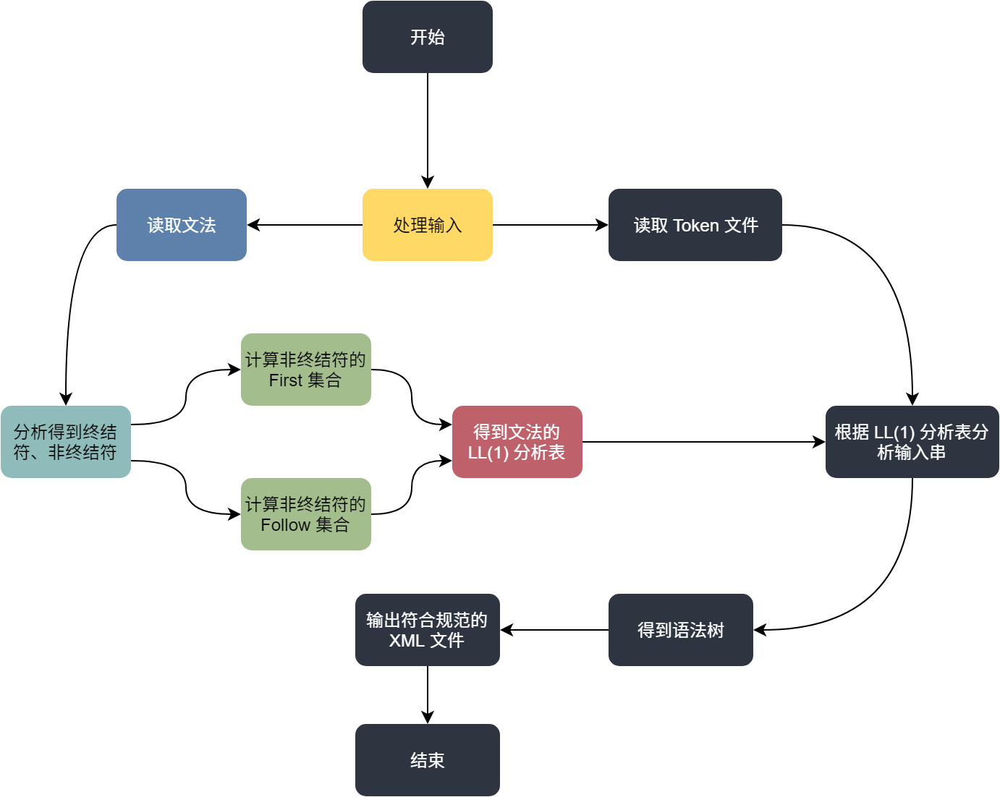
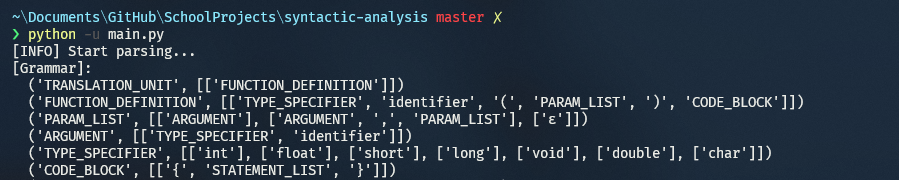
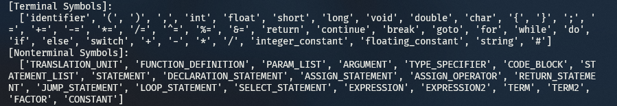
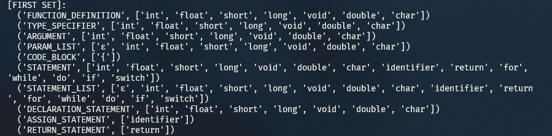
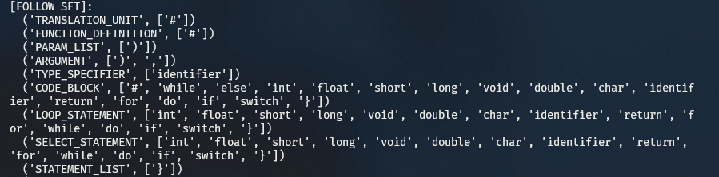
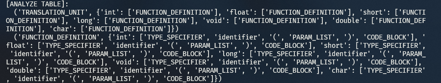
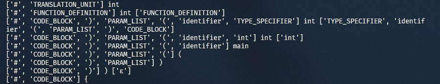
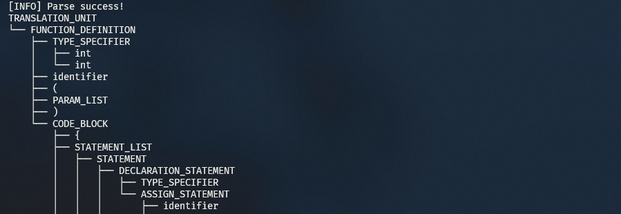
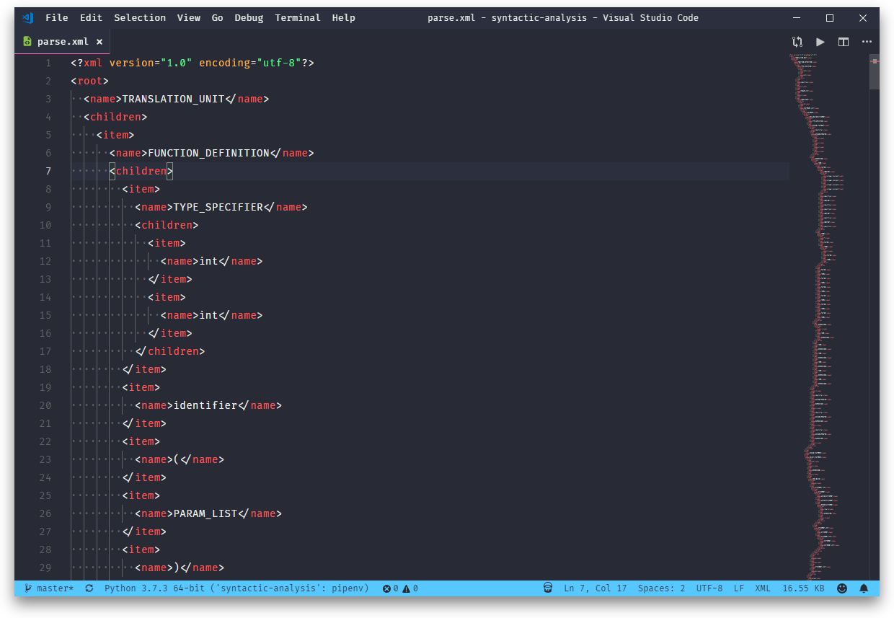

# syntactic-analysis

> 【编译原理】语法分析实验

## Design



## Usage

Install dependencies:

```bash
pipenv install
```

Enter Python virtual environment:

```bash
pipenv shell
```

Input files are located at:

```
.
└── test
    ├── input.c         // Input C file
    ├── input.token.xml // Tokenized C file (from last lexcial analysis)
    └── parse.xml       // Created XML file (from this syntatic analysis)
```

Main executables are located at:

```
.
├── grammar.txt      // Grammar file
├── main.py          // Main python file
├── parserGeneral.py // Create parse tree
└── parserUtils.py   // Analyze grammar, create LL(1) analyze table
```

Run a test with command:

```bash
python -u main.py
```

Which will produce the following outputs:

1. Grammar:



2. Terminal and non-terminal symbols:



3. First and follow sets:





4. LL(1) Parse table:



5. Analyze stack:



6. Grammar tree:



7. XML Document:



## Others

1. `firstsetgrammar.txt`  is for testing purposed only. You can try this grammar by uncommenting the following lines in `main.py`:

```python
# 5. Demo: 分析一个串 i+i*i
inputString = 'i+i*i'
parserGeneral.parseInputString(
    inputString, grammar, terminalSymbols, nonTerminalSymbols, analyzeTable)

# Then comment the following lines in main.py until the end of the main function.
```

2. `logLevel = 10` will produce verbose logs, for most circumstances, `logLevel = 1` will be sufficient.